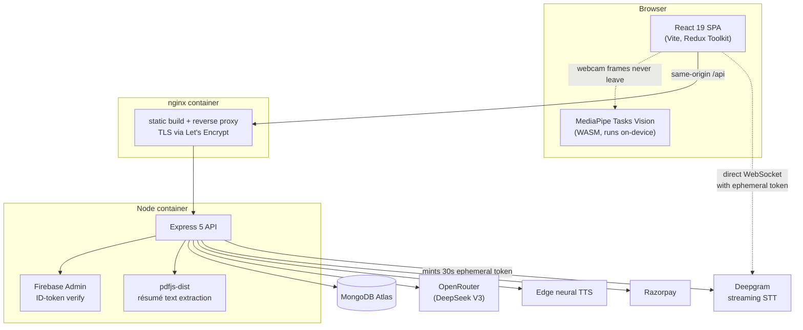
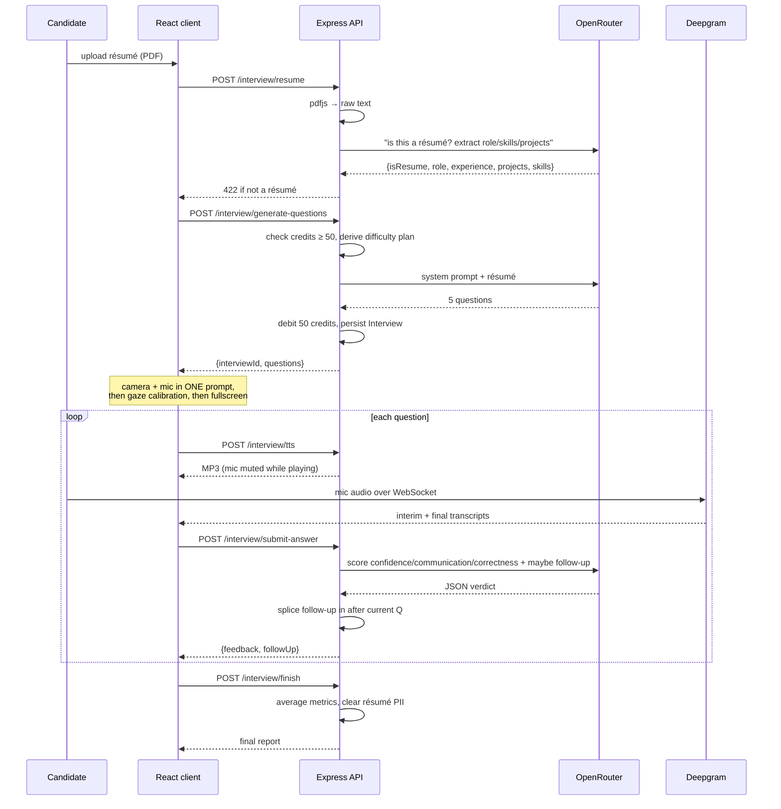

# Assessly

**AI-powered mock interviews that actually read your résumé — and watch you take them.**

Assessly runs a full voice interview in the browser. You upload your résumé, it extracts your real projects and skills, generates five questions grounded in them, speaks them aloud in a neural voice, listens to your spoken answers in real time, cross-questions you when an answer is thin, and scores you on confidence, communication and correctness. The whole session is proctored — tab switching, leaving fullscreen, a phone in frame, a second face, or your eyes drifting off-screen all cost you a strike. Three strikes voids the run.

🔗 **Live:** [assessly.ddnsgeek.com](https://assessly.ddnsgeek.com)

---

## Why this exists

Most mock-interview tools ask generic questions off a role title — "What is a closure?" for anyone who types *Frontend Engineer*. That's a quiz, not an interview. A real interviewer has your résumé open and asks *"You said you moved that service off Redis — what broke first?"*

Assessly is built around that difference. The résumé is mandatory, it's the primary source for every question, and at least three of the five must name a specific project or skill from it. If you upload something that isn't a résumé, the run is refused rather than silently producing generic questions.

---

## Features

| | |
|---|---|
| **Résumé-grounded questions** | PDF is parsed server-side, classified as a résumé or rejected, then mined for role, experience, projects and skills |
| **Difficulty that tracks seniority** | Experience maps to a real difficulty *and timing* plan — a 6-year candidate gets `medium→hard→hard` with 150s to think; a fresher gets `easy→easy→medium` with 60s |
| **Live voice answers** | Deepgram streaming STT — words appear as you speak, sub-second |
| **Neural interviewer voice** | Microsoft Edge neural TTS, streamed as MP3 from the backend |
| **Adaptive cross-questioning** | A substantive answer can trigger one follow-up that references what you actually said. Follow-ups never spawn follow-ups |
| **Camera proctoring** | In-browser MediaPipe: phone detection, second-person detection, absence, and looking-away from **both** head pose and iris gaze |
| **Behavioral proctoring** | Tab switch, fullscreen exit, and window blur — detected and struck |
| **Scored report + PDF** | Per-question breakdown, metric rings, trend chart, downloadable PDF |
| **Credits + payments** | Razorpay checkout with HMAC signature verification |

---

## Architecture



The browser talks to exactly **one origin**. nginx serves the React build and reverse-proxies `/api` to the Node container, which is never exposed to the internet. That's why the auth cookie is a plain same-origin `httpOnly` cookie with no cross-site `SameSite=None` gymnastics.

---

## How an interview actually runs



---

## Engineering decisions worth calling out

**The server owns the proctoring verdict, not the browser.** The client can only report *"something happened"*. The strike count, the threshold, and the terminate decision all live in `recordViolation`, behind an ownership check, using an atomic `findOneAndUpdate` guarded on `status: "Incompleted"` so two simultaneous strikes can't double-count a run another request already ended. A tampered client can fake a violation *against itself* — it cannot fake its way out of one.

**The browser never holds the Deepgram key.** Real-time transcription needs a direct browser→Deepgram WebSocket, which naively means shipping an API key to the client. Instead the server mints a **30-second ephemeral token** per listening session (`auth.v1.tokens.grant`). Long enough to open the socket, near-worthless if leaked.

**Camera frames never leave the device.** All vision inference runs in-browser through MediaPipe's WASM runtime. Only a short reason string (`"phone-detected"`) is sent to the server. This was a deliberate privacy call — the alternative, streaming webcam to a backend, would be cheaper to build and far worse for the user.

**Looking-away is calibrated per session, not absolute.** Everyone sits differently. Before detection arms, the candidate looks at a dot for 2.5s and the hook averages their neutral yaw, pitch and iris position into a baseline; violations are measured as *deviation from that baseline*. It also requires a condition to hold continuously (1.2s for gaze, 4s for absence) with an 8s per-reason cooldown — ML output is noisy, and a single bad frame shouldn't cost someone their interview.

**Camera and mic are requested together, up front.** A mid-interview permission prompt steals window focus, which the behavioral proctor would correctly read as a `window-blur` violation. Asking once, before detection arms, avoids penalizing someone for a prompt the app itself triggered.

**GPU delegate with a CPU fallback.** MediaPipe's WebGL delegate fails when hardware acceleration is off. Task creation tries GPU, catches, and retries on CPU. And if inference throws 12 times consecutively, the loop stops entirely rather than pegging the main thread — the interview continues with behavioral proctoring only. Degrade, don't die.

**LLM JSON is treated as hostile.** Models wrap JSON in ``` fences and add stray prose. `extractJson` strips fences, falls back to regex-matching the first `{...}` block, and only then parses — because a bare `JSON.parse` on model output is a 500 waiting to happen.

**Auth verifies a Firebase ID token, not a posted email.** The client sends the signed `idToken`; the server calls `adminAuth.verifyIdToken` and takes the email from the *verified* payload. Trusting an email from the request body would let anyone sign in as anyone.

**Rate limits are keyed per-user on the expensive routes.** Several endpoints call paid third parties with no credit cost to the caller — a loop would run up a real bill. Pre-auth routes are IP-keyed; post-auth routes key on `req.userId`, which is fairer behind shared NAT and ties the cap to the account. `trust proxy` is set to exactly **1** in production so the limiter reads the real client IP from nginx's `X-Forwarded-For`, and to `false` in dev where the header would be spoofable.

**Résumé text is deleted when the interview ends.** It's needed only to generate questions. On finish *or* termination, `resumeText` is set to `""` so name, email and phone don't sit in the database for the life of the record.

---

## Tech stack

**Frontend** — React 19, Vite 7, Redux Toolkit, React Router 7, Tailwind 4, Motion, Recharts, jsPDF, MediaPipe Tasks Vision, Deepgram JS SDK

**Backend** — Node 20, Express 5, Mongoose 9, Firebase Admin, pdfjs-dist, msedge-tts, express-rate-limit, Multer, Razorpay

**Infra** — Docker Compose, nginx (static + reverse proxy), Let's Encrypt via certbot with 12-hourly renewal, MongoDB Atlas

---

## Running locally

**Prerequisites:** Node 20+, a MongoDB connection string, and keys for OpenRouter, Deepgram and Firebase.

```bash
git clone https://github.com/ayushm3018/Assessly-.git
cd Assessly-
```

**Backend**

```bash
cd server
npm install
# create server/.env — see below
npm run dev          # → http://localhost:8000
```

`server/.env`:

```ini
PORT=8000
MONGODB_URL=mongodb+srv://...
JWT_SECRET=any-long-random-string
OPENROUTER_API_KEY=sk-or-...
AI_MODEL=deepseek/deepseek-chat
DEEPGRAM_API_KEY=...            # key must have the "Member" role for token grants
RAZORPAY_KEY_ID=rzp_test_...
RAZORPAY_KEY_SECRET=...
CLIENT_URL=http://localhost:5173
```

Also drop your Firebase service-account JSON at `server/config/serviceAccount.json` (gitignored), or set `FIREBASE_SERVICE_ACCOUNT` to the raw JSON string.

**Frontend**

```bash
cd client
npm install
# create client/.env
npm run dev          # → http://localhost:5173
```

`client/.env`:

```ini
VITE_SERVER_URL=http://localhost:8000
VITE_RAZORPAY_KEY_ID=rzp_test_...
```

> **Note:** camera proctoring needs WebGL. If hardware acceleration is off, the app logs a warning, disables camera detection, and continues with behavioral proctoring. Open the interview with `?debug` to see live detection metrics.

---

## Deployment

Single-box Docker Compose. The client image is a two-stage build (Vite build → nginx), the server image is Node 20 slim.

```bash
docker compose up -d --build
```

Two things that bite here and are handled explicitly:

- **Vite inlines env vars at build time**, so `VITE_*` values are passed as Docker **build args**, not runtime env. In production `VITE_SERVER_URL` is empty, making every API call relative and same-origin.
- **Node's default heap ceiling OOMs the Vite build on a 1GB instance** (exit 134). `NODE_OPTIONS=--max-old-space-size=2048` in the client Dockerfile fixes it.

Secrets are never baked into images — `serviceAccount.json` is bind-mounted read-only and `.env` comes in via `env_file`.

---

## Project structure

```
server/
  config/        db connection, Firebase Admin, JWT signing
  middlewares/   isAuth, multer upload, rate limiters
  models/        User, Interview (embedded questions), Payment
  services/      openRouter, deepgram, tts, razorpay
  controllers/   auth, user, payment, interview  ← interview.controller.js is the core
  routes/

client/src/
  hooks/         useInterviewFlow, useDeepgramSpeech, useTextToSpeech,
                 useProctoring, useCameraProctoring, useInterviewProctoring
  components/
    interview/   the proctored interview screens
    report/      score hero, metric rings, trend chart, breakdown
  pages/         Home, Auth, InterviewPage, InterviewHistory, InterviewReport, Pricing
  utils/         interviewApi, proctoring labels, PDF builder, firebase
```

The interview screen is deliberately split so that `Step2Interview.jsx` is a pure orchestrator — it owns no UI logic, instantiates the four hooks, wires the cross-cutting callbacks between them, and picks a screen. Speech, TTS, question flow, and proctoring each stay independently readable.

---

## Screenshots

<!-- Add real captures here, e.g.:


-->

*Coming soon.*

---

## Known limitations

- Rate limiting uses an in-memory store — it resets on restart and wouldn't be shared across multiple API instances. A Redis store is the fix if this ever scales past one box.
- MediaPipe models load from a CDN, so an aggressive ad/script blocker can block them. Self-hosting the `.task` files under `client/public` removes the dependency.
- Proctoring is desktop-only and deliberately conservative; opening devtools fires `blur` and counts as a strike.
- Follow-up questions are included in the final average, which slightly changes the denominator for candidates who get cross-questioned.
- No automated test suite yet — the highest-value additions would be integration tests around `submitAnswer` and `recordViolation`, where the scoring and strike logic live.

---

## License

ISC
